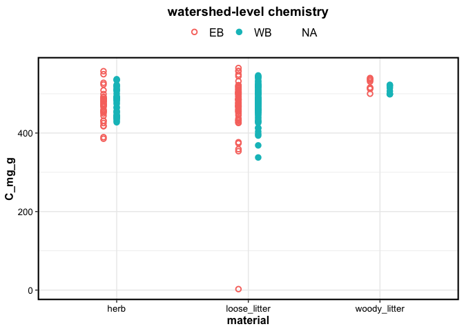

BBWM carbon budget
================

VEGETATION – click here

## VEGETATION CHEMISTRY

<table class="kable_wrapper">
<tbody>
<tr>
<td>

| material | species | watershed | TC\_perc |   se |   n |
|:---------|:--------|:----------|---------:|-----:|----:|
| foliage  | AB      | EB        |    48.65 | 0.63 |  20 |
| foliage  | RM      | EB        |    50.24 | 0.46 |  20 |
| foliage  | SM      | EB        |    48.70 | 0.41 |  28 |
| foliage  | YB      | EB        |    47.88 | 0.61 |  20 |
| foliage  | RS      | EB        |    51.18 | 0.26 |  38 |

</td>
<td>

| watershed | TC\_perc |   se |   n |
|:----------|---------:|-----:|----:|
| WB        |    48.62 | 0.50 |  19 |
| WB        |    50.88 | 0.98 |  19 |
| WB        |    49.41 | 0.54 |  26 |
| WB        |    48.49 | 0.36 |  19 |
| WB        |    50.82 | 0.24 |  38 |

</td>
</tr>
</tbody>
</table>
<table class="kable_wrapper">
<tbody>
<tr>
<td>

| material | species | watershed | TC\_perc |   se |   n |
|:---------|:--------|:----------|---------:|-----:|----:|
| wood     | AB      | EB        |    51.72 | 1.04 |  10 |
| wood     | RM      | EB        |    49.81 | 0.75 |  14 |
| wood     | SM      | EB        |    54.88 | 2.63 |  18 |
| wood     | YB      | EB        |    50.69 | 1.88 |  17 |
| wood     | RS      | EB        |    49.31 | 0.34 |  14 |

</td>
<td>

| watershed | TC\_perc |   se |   n |
|:----------|---------:|-----:|----:|
| WB        |    51.56 | 2.40 |  13 |
| WB        |    46.11 | 2.46 |  18 |
| WB        |    51.29 | 2.42 |  14 |
| WB        |    58.42 | 7.77 |  15 |
| WB        |    50.27 | 0.77 |  14 |

</td>
</tr>
</tbody>
</table>
<table class="kable_wrapper">
<tbody>
<tr>
<td>

| material      | forest | watershed | TC\_perc |   se |   n |
|:--------------|:-------|:----------|---------:|-----:|----:|
| herb          | HW     | EB        |    46.03 | 0.54 |  30 |
| herb          | SW     | EB        |    50.40 | 1.15 |  10 |
| loose\_litter | HW     | EB        |    47.19 | 0.74 |  31 |
| loose\_litter | SW     | EB        |    48.99 | 1.73 |  30 |
| woody\_litter | HW     | EB        |    51.08 | 0.36 |   4 |
| woody\_litter | SW     | EB        |    53.60 | 0.19 |   4 |

</td>
<td>

| watershed | TC\_perc |   se |   n |
|:----------|---------:|-----:|----:|
| WB        |    47.14 | 0.74 |  24 |
| WB        |    49.23 | 0.66 |  14 |
| WB        |    46.26 | 0.66 |  31 |
| WB        |    50.55 | 0.49 |  31 |
| WB        |    50.86 | 0.57 |   4 |
| WB        |    51.21 | 0.54 |   4 |

</td>
</tr>
</tbody>
</table>

    ## $gg_species

<!-- -->

    ## 
    ## $gg_ws

<!-- -->

#### *note: we need to remove outliers*

------------------------------------------------------------------------

## VEGETATION BIOMASS (kg/ha)

<table class="kable_wrapper">
<tbody>
<tr>
<td>

| material      | forest | EB             | WB             |
|:--------------|:-------|:---------------|:---------------|
| foliage       | HW     | 4321 ± 397     | 5627 ± 740     |
| branches      | HW     | 19915 ± 2483   | 32590 ± 4926   |
| stem          | HW     | 113767 ± 12378 | 158697 ± 19837 |
| stumproot     | HW     | 34145 ± 3646   | 48159 ± 6345   |
| loose\_litter | HW     | 5430 ± 565     | 5535 ± 681     |
| herb          | HW     | 39086 ± 13333  | 20193 ± 4405   |

</td>
<td>

| forest | EB            | WB              |
|:-------|:--------------|:----------------|
| SW     | 27701 ± 1391  | 31265 ± 1523    |
| SW     | 26118 ± 1478  | 30126 ± 1393    |
| SW     | 163426 ± 9730 | 189910 ± 8697   |
| SW     | 57459 ± 3303  | 66373 ± 3079    |
| SW     | 17506 ± 2850  | 13804 ± 2753    |
| SW     | 87105 ± 45051 | 194216 ± 169973 |

</td>
</tr>
</tbody>
</table>

------------------------------------------------------------------------

## VEGETATION CARBON STOCKS (kg/ha)

<table class="kable_wrapper">
<tbody>
<tr>
<td>

| material      | forest | EB           | WB            |
|:--------------|:-------|:-------------|:--------------|
| foliage       | HW     | 2115 ± 194   | 2742 ± 358    |
| branches      | HW     | 10172 ± 1268 | 16576 ± 2505  |
| stem          | HW     | 58657 ± 6405 | 83154 ± 10925 |
| stumproot     | HW     | 17598 ± 1881 | 25285 ± 3506  |
| loose\_litter | HW     | 2562 ± 266   | 2560 ± 315    |
| herb          | HW     | 17990 ± 6137 | 9519 ± 2076   |

</td>
<td>

| forest | EB            | WB            |
|:-------|:--------------|:--------------|
| SW     | 14176 ± 712   | 15890 ± 774   |
| SW     | 13999 ± 792   | 15426 ± 713   |
| SW     | 80584 ± 4798  | 95460 ± 4371  |
| SW     | 28332 ± 1629  | 33363 ± 1548  |
| SW     | 8576 ± 1396   | 6978 ± 1391   |
| SW     | 43902 ± 22707 | 95605 ± 83671 |

</td>
</tr>
</tbody>
</table>

<!-- -->

#### *note: we need to double check “herb”*

------------------------------------------------------------------------

SOILS – click here

#### soil mass, kg/ha

<table class="kable_wrapper">
<tbody>
<tr>
<td>

| horizon | forest | EB               | WB               | stats |
|:--------|:-------|:-----------------|:-----------------|:------|
| O       | HW     | 163136 ± 28812   | 116401 ± 22600   |       |
| B       | HW     | 1245435 ± 238552 | 1734049 ± 263088 |       |
| C       | HW     | 2089446 ± 338367 | 2508899 ± 316064 |       |

</td>
<td>

| forest | EB               | WB               | stats |
|:-------|:-----------------|:-----------------|:------|
| SW     | 166954 ± 20492   | 238345 ± 22703   | \*    |
| SW     | 1677046 ± 408610 | 1452023 ± 246001 |       |
| SW     | 2778552 ± 474351 | 1783470 ± 431008 |       |

</td>
</tr>
</tbody>
</table>

#### TC percentage

<table class="kable_wrapper">
<tbody>
<tr>
<td>

| depth   | forest | EB           | WB           | stats |
|:--------|:-------|:-------------|:-------------|:------|
| O       | HW     | 25.05 ± 2.13 | 36.07 ± 2.15 | \*    |
| 0-5cm   | HW     | 8.55 ± 0.75  | 8.23 ± 0.31  |       |
| 5-25cm  | HW     | 6.14 ± 0.59  | 6.06 ± 0.57  |       |
| 25-50cm | HW     | 4.34 ± 0.25  | 3.71 ± 0.95  |       |
| 50-C    | HW     | 3.1 ± 1.23   | 3 ± 0.71     |       |
| 25-C    | HW     | 4.59 ± 1.39  | 3.61 ± 0.65  |       |
| C       | HW     | 3.64 ± 0.88  | 2.31 ± 0.41  |       |

</td>
<td>

| forest | EB           | WB           | stats |
|:-------|:-------------|:-------------|:------|
| SW     | 42.77 ± 1.91 | 39.66 ± 2.77 |       |
| SW     | 8.66 ± 0.91  | 9.1 ± 0.52   |       |
| SW     | 7.15 ± 0.94  | 7.71 ± 0.57  |       |
| SW     | 11.44 ± 1.98 | 7.58 ± 1.34  |       |
| SW     | 8.91 ± 4.4   | 5.54 ± 0.16  |       |
| SW     | 5.14 ± 0.9   | 5.14 ± 1.55  |       |
| SW     | 2.61 ± 0.47  | 3.22 ± 0.39  |       |

</td>
</tr>
</tbody>
</table>

#### TC kg/ha

<table class="kable_wrapper">
<tbody>
<tr>
<td>

| horizon | forest | EB            | WB           |
|:--------|:-------|:--------------|:-------------|
| O       | HW     | 37010 ± 4160  | 44113 ± 9058 |
| B       | HW     | 67084 ± 11819 | 84268 ± 9955 |
| C       | HW     | 70091 ± 16765 | 51832 ± 7312 |

</td>
<td>

| forest | EB             | WB             |
|:-------|:---------------|:---------------|
| SW     | 71683 ± 10285  | 94445 ± 8853   |
| SW     | 133934 ± 47265 | 105214 ± 20144 |
| SW     | 79451 ± 23411  | 53772 ± 14189  |

</td>
</tr>
</tbody>
</table>

------------------------------------------------------------------------

STREAMS – click here

<!-- -->

<!-- -->

<!-- -->

------------------------------------------------------------------------

Session Info

Date run: 2021-02-15

Session Info:

    ## R version 4.0.2 (2020-06-22)
    ## Platform: x86_64-apple-darwin17.0 (64-bit)
    ## Running under: macOS Catalina 10.15.7
    ## 
    ## Matrix products: default
    ## BLAS:   /System/Library/Frameworks/Accelerate.framework/Versions/A/Frameworks/vecLib.framework/Versions/A/libBLAS.dylib
    ## LAPACK: /Library/Frameworks/R.framework/Versions/4.0/Resources/lib/libRlapack.dylib
    ## 
    ## locale:
    ## [1] en_US.UTF-8/en_US.UTF-8/en_US.UTF-8/C/en_US.UTF-8/en_US.UTF-8
    ## 
    ## attached base packages:
    ## [1] stats     graphics  grDevices utils     datasets  methods  
    ## [7] base     
    ## 
    ## other attached packages:
    ##  [1] soilpalettes_0.1.0 lme4_1.1-26        Matrix_1.3-2      
    ##  [4] nlme_3.1-151       gt_0.2.2           drake_7.13.0      
    ##  [7] readxl_1.3.1       forcats_0.5.1      stringr_1.4.0     
    ## [10] dplyr_1.0.3        purrr_0.3.4        readr_1.4.0       
    ## [13] tidyr_1.1.2        tibble_3.0.6       ggplot2_3.3.3     
    ## [16] tidyverse_1.3.0   
    ## 
    ## loaded via a namespace (and not attached):
    ##  [1] httr_1.4.2         sass_0.3.1         jsonlite_1.7.2    
    ##  [4] splines_4.0.2      modelr_0.1.8       assertthat_0.2.1  
    ##  [7] statmod_1.4.35     highr_0.8          base64url_1.4     
    ## [10] cellranger_1.1.0   yaml_2.2.1         progress_1.2.2    
    ## [13] pillar_1.4.7       backports_1.2.1    lattice_0.20-41   
    ## [16] glue_1.4.2         digest_0.6.27      RColorBrewer_1.1-2
    ## [19] checkmate_2.0.0    minqa_1.2.4        rvest_0.3.6       
    ## [22] colorspace_2.0-0   htmltools_0.5.1.1  pkgconfig_2.0.3   
    ## [25] broom_0.7.4        haven_2.3.1        scales_1.1.1      
    ## [28] txtq_0.2.3         generics_0.1.0     farver_2.0.3      
    ## [31] ellipsis_0.3.1     withr_2.4.1        cli_2.2.0         
    ## [34] magrittr_2.0.1     crayon_1.4.0       evaluate_0.14     
    ## [37] storr_1.2.5        fs_1.5.0           fansi_0.4.2       
    ## [40] MASS_7.3-53        xml2_1.3.2         tools_4.0.2       
    ## [43] prettyunits_1.1.1  hms_1.0.0          lifecycle_0.2.0   
    ## [46] munsell_0.5.0      reprex_1.0.0       compiler_4.0.2    
    ## [49] tinytex_0.29       rlang_0.4.10       nloptr_1.2.2.2    
    ## [52] grid_4.0.2         rstudioapi_0.13    igraph_1.2.6      
    ## [55] labeling_0.4.2     rmarkdown_2.6.6    boot_1.3-26       
    ## [58] gtable_0.3.0       DBI_1.1.1          R6_2.5.0          
    ## [61] lubridate_1.7.9.2  knitr_1.31         utf8_1.1.4        
    ## [64] filelock_1.0.2     stringi_1.5.3      parallel_4.0.2    
    ## [67] Rcpp_1.0.6         vctrs_0.3.6        dbplyr_2.0.0      
    ## [70] tidyselect_1.1.0   xfun_0.20

