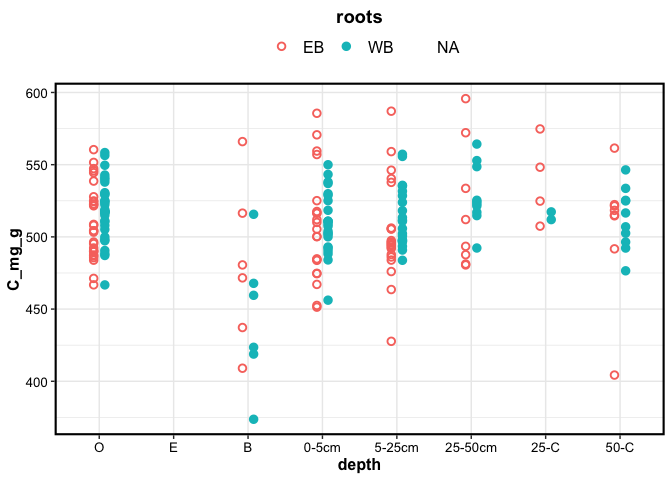

Chemistry
================

    ## $gg_species

<!-- -->

    ## 
    ## $gg_ws

<!-- -->

    ## 
    ## $gg_roots

<!-- -->

------------------------------------------------------------------------

Session Info

Date run: 2021-02-05

Session Info:

    ## R version 4.0.2 (2020-06-22)
    ## Platform: x86_64-apple-darwin17.0 (64-bit)
    ## Running under: macOS Catalina 10.15.7
    ## 
    ## Matrix products: default
    ## BLAS:   /System/Library/Frameworks/Accelerate.framework/Versions/A/Frameworks/vecLib.framework/Versions/A/libBLAS.dylib
    ## LAPACK: /Library/Frameworks/R.framework/Versions/4.0/Resources/lib/libRlapack.dylib
    ## 
    ## locale:
    ## [1] en_US.UTF-8/en_US.UTF-8/en_US.UTF-8/C/en_US.UTF-8/en_US.UTF-8
    ## 
    ## attached base packages:
    ## [1] stats     graphics  grDevices utils     datasets 
    ## [6] methods   base     
    ## 
    ## other attached packages:
    ##  [1] forcats_0.5.1   stringr_1.4.0   dplyr_1.0.3    
    ##  [4] purrr_0.3.4     readr_1.4.0     tidyr_1.1.2    
    ##  [7] tibble_3.0.6    ggplot2_3.3.3   tidyverse_1.3.0
    ## [10] drake_7.13.0   
    ## 
    ## loaded via a namespace (and not attached):
    ##  [1] storr_1.2.5       progress_1.2.2    xfun_0.20        
    ##  [4] tidyselect_1.1.0  haven_2.3.1       colorspace_2.0-0 
    ##  [7] vctrs_0.3.6       generics_0.1.0    htmltools_0.5.1.1
    ## [10] yaml_2.2.1        rlang_0.4.10      pillar_1.4.7     
    ## [13] withr_2.4.1       txtq_0.2.3        glue_1.4.2       
    ## [16] DBI_1.1.1         dbplyr_2.0.0      modelr_0.1.8     
    ## [19] readxl_1.3.1      lifecycle_0.2.0   munsell_0.5.0    
    ## [22] gtable_0.3.0      cellranger_1.1.0  rvest_0.3.6      
    ## [25] evaluate_0.14     knitr_1.31        labeling_0.4.2   
    ## [28] parallel_4.0.2    fansi_0.4.2       highr_0.8        
    ## [31] broom_0.7.4       Rcpp_1.0.6        backports_1.2.1  
    ## [34] scales_1.1.1      filelock_1.0.2    jsonlite_1.7.2   
    ## [37] farver_2.0.3      fs_1.5.0          hms_1.0.0        
    ## [40] digest_0.6.27     stringi_1.5.3     grid_4.0.2       
    ## [43] cli_2.2.0         tools_4.0.2       magrittr_2.0.1   
    ## [46] base64url_1.4     crayon_1.4.0      pkgconfig_2.0.3  
    ## [49] ellipsis_0.3.1    xml2_1.3.2        prettyunits_1.1.1
    ## [52] reprex_1.0.0      lubridate_1.7.9.2 rmarkdown_2.6.6  
    ## [55] assertthat_0.2.1  httr_1.4.2        rstudioapi_0.13  
    ## [58] R6_2.5.0          igraph_1.2.6      compiler_4.0.2

